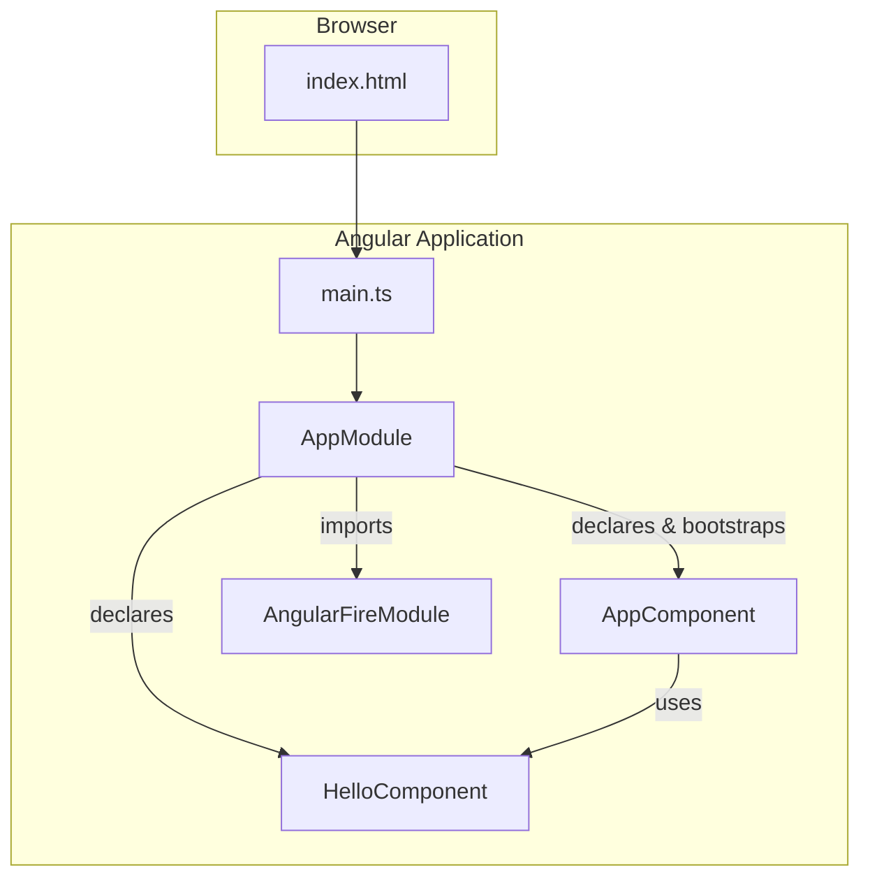

# angular-firebase

[Edit on StackBlitz ⚡️](https://stackblitz.com/edit/angular-ivy-kcyvff)

## Project Architecture

```mermaid
graph TD
    subgraph "Browser"
        index["index.html"]
    end

    subgraph "Angular Application"
        main["main.ts"]
        AppModule["AppModule"]
        AppComponent["AppComponent"]
        HelloComponent["HelloComponent"]
        AngularFireModule["AngularFireModule"]
    end

    index --> main
    main --> AppModule
    AppModule -- imports --> AngularFireModule
    AppModule -- declares & bootstraps --> AppComponent
    AppModule -- declares --> HelloComponent
    AppComponent -- uses --> HelloComponent
```